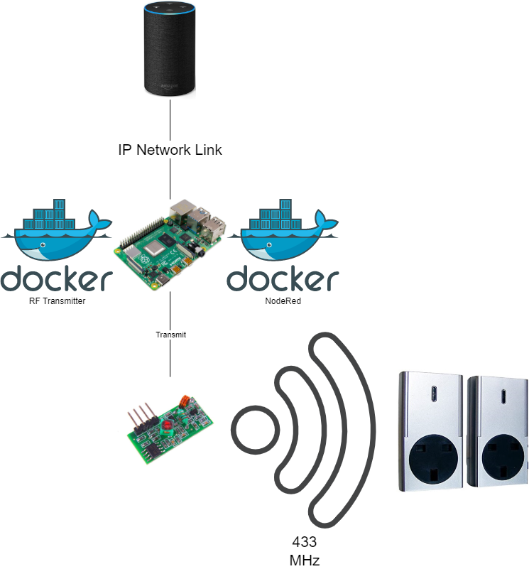

#RF Plugs Transmitter

# Summary
This project contains a system in which regular RF plugs can be used alongside smart plugs. This allows the user to reuse
their old RF plugs and as new smart plugs. Preventing e-waste and saving money. In order to do this the following systems are needed.
- Smart Home Agent (Alexa, Google Home)
- [NodeRed](https://nodered.org/)
- Raspberry Pi

# Architecture
The system works using a Raspberry Pi as the central control system which is running both NodeRed and the 
SocketTransmitter python script. Both of these are running in their own docker container to allow for better modularisation.

The Alexa devices are connected over the network using any IP link, that could be simply through a WiFi link. 
As long as the devices are on the same network.

- The Raspberry Pi is then connected to the 433MHz Transmitter module via connecting the 5V, GND and Transmit pin.
- The flows attached to this repo are then use to communicate with the SocketTransmitter via TCP which then send the 
required bit stream signal to the script, which then is used to turn the plugs on and off.
- The system is built such that, when the SocketTransmitter container is up and running, it never needs to be taken down.

# Parts
The parts required for the project are listed below:

[Easy On Easy Off Plugs](https://www.amazon.co.uk/Home-Easy-Remote-Control-Socket/dp/B00KC7AHMM)

[433MHz Transmitter Receiver Pack](https://www.aliexpress.com/item/4000018571977.html?spm=a2g0o.productlist.0.0.76831160l0sedh&algo_pvid=4ed97a32-f054-4d1c-8f60-14a1a476c9e2&algo_exp_id=4ed97a32-f054-4d1c-8f60-14a1a476c9e2-1&pdp_ext_f=%7B%22sku_id%22%3A%2210000000043504110%22%7D&pdp_pi=-1%3B0.61%3B-1%3B-1%40salePrice%3BGBP%3Bsearch-mainSearch)

[Raspberry Pi Foundation](https://www.raspberrypi.org/)

[Logic Analyser](https://www.amazon.co.uk/gp/product/B00DAYAREW/ref=ppx_yo_dt_b_search_asin_image?ie=UTF8&psc=1)
